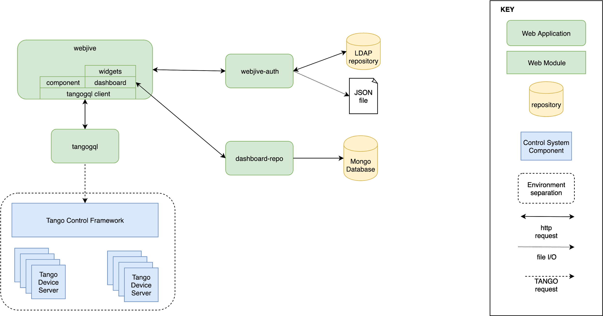

WebJive Architecture
####################

WebJive is composed of four projects: 

#. **webjive**  https://gitlab.com/MaxIV/webjive

#. **WebJive Dashboards**  https://gitlab.com/MaxIV/dashboard-repo

#. **WebJive Auth**  https://gitlab.com/MaxIV/webjive-auth

#. **web-maxiv-tangogql**  https://gitlab.com/MaxIV/web-maxiv-tangogql

In the diagram below, an overview of WebJive architecture has been shown. 

\ |IMG1|\ 

#. *WebJive Architecture diagram* 

**webjive**  is a React_  client that permits to explore Tango devices and to create custom dashboards, using a collection of widgets. webjive accesses to the Tango Control Framework through **tangogql**. The communication between webjive and tangogql is managed by a library into webjive. **tangogql**  is a GraphQL_  interface for Tango.

.. _React: https://reactjs.org/
.. _GraphQL: https://graphql.org/

In order to sends command and save dashboards, it is necessary to login to the system. webjive uses **webjive-auth**  to manage users. **webjive-auth**  accesses to LDAP repository or JSON file to retrieve user information. 

The dashboards created by the user logged in the system, are stored in a MongoDB_  database through **dashboard-repo**  application. 

.. _MongoDB: https://www.mongodb.com/

