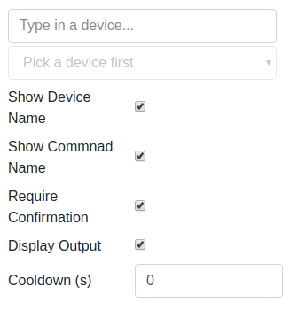
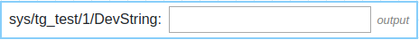

Command Writer Widget
**********

The widget enables the user to send a command with parameters to a certain device 

Widget setting 
===============

The user as the hability to select:

* Show device name (boolean)
* Show command name (boolean)
* Require confirmation (boolean)
* Display output (boolean)
* Cooldown in seconds (integer)

\ |IMG1|\ 

*Notice: For a command to be listed on the widget, the accepted parameters must be either a string or an integer

Widget design 
===============

\ |IMG2|\ 

*Notice: To actually send a command to the device the user must hit ENTER key, if the "Require confirmation" is 
select a pop up will show to confirm the command to send

At this point, the widget only accepts two types of parameters being a string or an integer.

All other types will give an error as a form of pop up for the user

.. bottom of content

