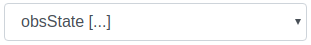

Attribute Display Widget
************************

The widget displays the value of a certain attribute, it can display the raw value, or in case of DevEnum types, it can also display the correspondent label

Widget setting 
==============

It is possible to set the widget in the backend. The following image shows an example of a widget setting. 

\ |IMG1|\ 

Once the device is selected, the widget will display it's attributes, if they are of the type DevEnum a symbol (*[...]*) will be display in front of the attribute name. 

\ |IMG2|\ 

It is possible to customize the widget setting in the backend, as the following table. 

Widget options 
==============

+--------------------+----------------------------------------------------+
|Input value         |Description                                         |
+====================+====================================================+
|Precision           |Integer for defining significative numbers of value |
+--------------------+----------------------------------------------------+
|Device Name         |Boolean for displaying device name                  |
+--------------------+----------------------------------------------------+
|Attribute Name      |Boolean for displaying attribute name               |
+--------------------+----------------------------------------------------+
|Scientific Notation |Boolean for displaying scientific notation          |
+--------------------+----------------------------------------------------+
|Show Enum Lables    |Boolean for displaying enum lables                  |
+--------------------+----------------------------------------------------+

.. bottom of content

