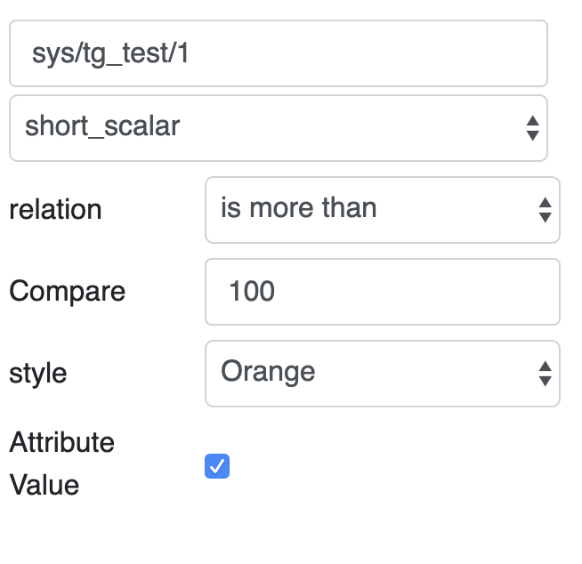
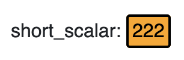

Led Widget
**********

The widget checks a simple conditional and displays a green led if the expected value or a led with a selected colour if false. 

In particular, the widget displays a led with a target colour if the actual device attribute value matches a set condition. Otherwise, it shows a green led. 

Widget setting 
===============

It is possible to set the widget in the backend. The following image shows an example of a widget setting. 

\ |IMG1|\ 

The widget takes the actual value of the attribute in the selected device. In the example the short_scalar attribute in the sys/tg_test/1 device. It matches the value with a Compare value, through a relation. In the example is more than. If the value matches the condition, the led widget shows the led based on the Style selected, in the example Orange. 

\ |IMG2|\ 

It is possible to customize the widget setting in the backend, as the following table. 

+---------------+------------------------------------------------------------------------------------------------------------------------------------------------+
|Input value    |Description                                                                                                                                     |
+===============+================================================================================================================================================+
|Relation       |Specify the type of relation. It could be: “is more than”, “is less than”, “is equal to”, “is more than or equal to”, “is less than or equal to”|
+---------------+------------------------------------------------------------------------------------------------------------------------------------------------+
|Compare        |Specify the target value                                                                                                                        |
+---------------+------------------------------------------------------------------------------------------------------------------------------------------------+
|Style          |Specify the colour that the led assumes when the actual value matches the condition. It could be: “Red” or “Orange”                             |
+---------------+------------------------------------------------------------------------------------------------------------------------------------------------+
|Attribute value|If selected, the widget shows the attribute name on the left of the led, and the actual value into the led. Otherwise, it shows only the led.   |
+---------------+------------------------------------------------------------------------------------------------------------------------------------------------+

.. bottom of content

